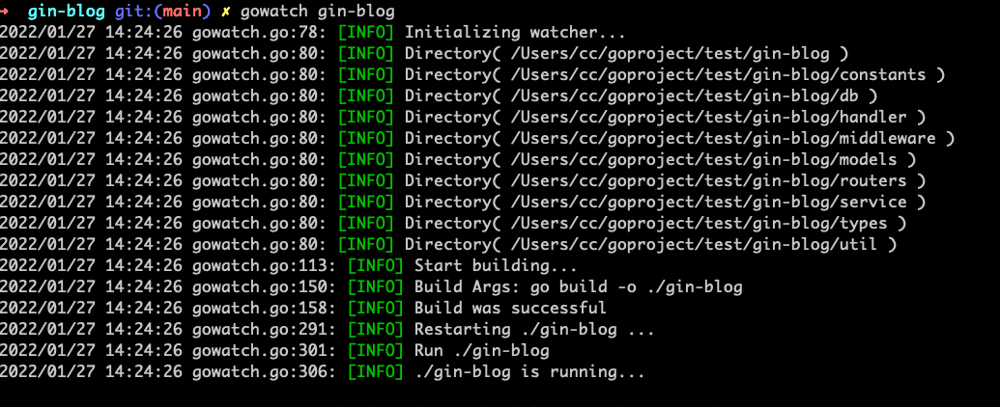
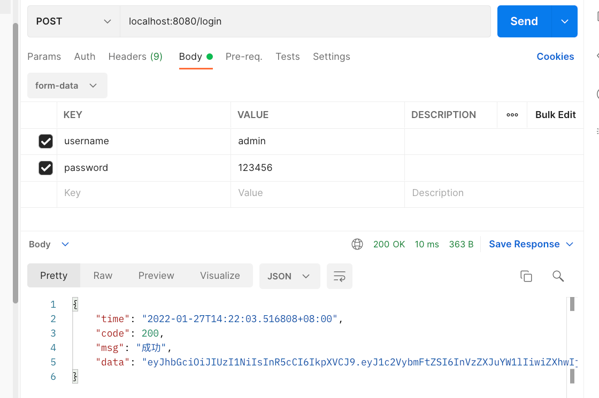

### Go语言开发博客。<br>
Go+Gin+Gorm
可查看我的博客：http://blog.caixiaoxin.cn

### 功能
```diff
+ 登陆--JWT
+ 创建管理员
+ 账号列表
+ 删除账号
+ 删除账号
+ 账号详情
+ 修改账号信息
+ 禁用
+ 启用
+ 创建标签
+ 标签列表
+ 修改标签名字
+ 删除标签
+ 创建分类
+ 分类列表
+ 修改分类名字
+ 删除分类
+ 写文章
+ 文章列表
+ 文章修改
+ 删除文章
+ 评论
+ 评论列表
+ 删除评论
+ 添加友联
+ 修改友联
+ 删除友联

```
### 设计目录结构
```shell
目录结构
	constants                       # 定义常量目录
		state.go 
	db                              # 数据库连接初始化
		core.go
	handler                         # 控制器
		......
	middleware                      # 中间件
		......
	models                          # 模型
		......
	routers                         # 路由
		router.go
	service                         # 服务层，业务逻辑处理，与models交互操作数据库
		......
	types                           # 状态码，状态信息
		code.go
	util                            # 工具包
		encrypt.go
		result.go
	.gitignore
	gin-blog
	go.mod 
	main.go
	README.md
``` 
### 本机部署
```git
git clone git@github.com:jeffcail/gin-blog.git
```
```shell
➜ cd gin-blog
➜ gowatch gin-blog
```


### 测试部署是否成功

